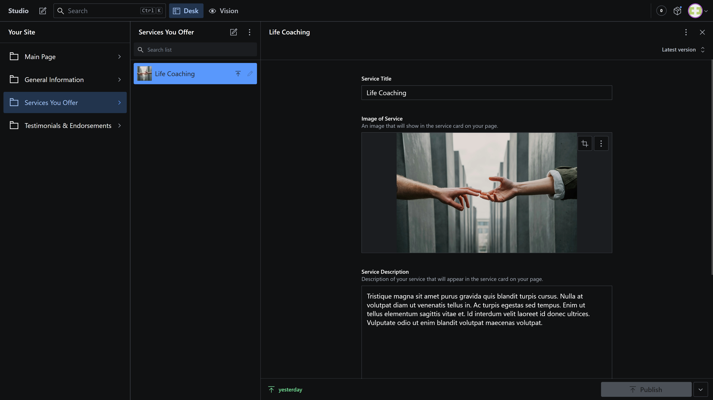

# Sanity Studio Walkthrough

The client is able to update site content and images through the Sanity Studio. The Sanity Studio uses React components developed by Sanity CMS and is configured using [schemas](../src/sanity/schemas).

## Main Page

This section configures the copy and images shown in the main content sections in the page: the Call-to-Action, the About Me, and the Email Subscription sections.

They are set up as "singletons"; new instances of these sections cannot be created, and each subsection is linked vis-a-vis with their respective sections on the page.

## General Information

This section configures general information that will be on the page. Site information sets up basic information that sets the title of the page both visually and in the `<head>` tag. Social media sets up links for various social media sites, which will be placed both in the top bar and the footer.

## Services

This section contains a list of services that the client can offer. The client can create multiple services, which will be displayed in the "Services" section of the page.

## Testimonials

This section contains a list of testimonials the client has received from their customers. The client can add as many testimonials as they wish, and they are shown in the "Testimonials" section of the page.

[Go back to main README](../README.md).
